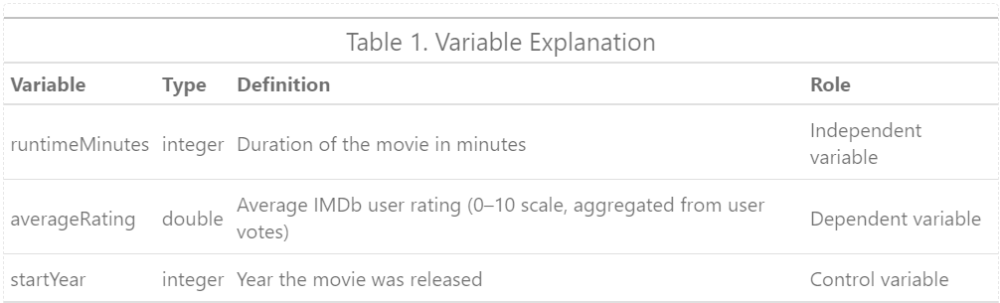
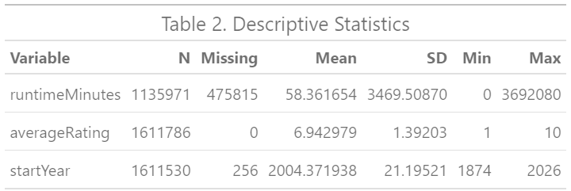

# Introduction
The purpose of this project is to examine whether and how movie length influences audience ratings, while controlling for release year. We aim to test if longer films are consistently perceived as higher quality or if extended runtimes risk diminishing audience engagement. By focusing directly on runtime rather than treating it as a side factor, we seek to establish a clear relationship between film length and ratings. This will allow us to identify whether there is an optimal duration for films and to understand how this relationship may have shifted over time.

## Motivation

In evaluating audience reception of films, factors such as actor performance, genre, and budget have been extensively studied as significant predictors of individual ratings (Wallace et al., 1993). Runtime, frequently included as a control variable in prior research, also carries meaningful implications for audience perception (Ashari et al., 2022). A longer duration of the movie often reflects higher production value and suggests a narrative depth that justifies viewers’ time investment. However, excessive runtime may adversely affect enjoyment due to decreased audience attention and potential fatigue. 

Empirical evidence on the relationship between movie duration and audience ratings remains inconclusive. Some studies identify a positive association, whereas others report a non-linear or genre specific effect. To address this gap, the current study investigates the influence of movie duration on audience ratings. 

Given that rating behaviour and audience preferences evolve over time (Amendola et al., 2015), we incorporate release year as a control variable to enhance the internal validity of our analysis and account for temporal dynamics in consumer behaviour. 

*Academic relevance*

This research addresses an underexplored dimension of firm evaluation. While previous research has mainly focused on factors such as actor performance (Liu et al., 2013), genre (Gupta et al., 2025), film directors (Antipov & Pokryshevskaya, 2016), and firm revenue (Zhang, 2025) as the main predictors of audience engagement, movie duration impact has often been relegated to the role of a control variable. Existing findings on the effect of movie duration remain unclear some studies report a positive association between longer runtimes and audience ratings (Choudhary et al., 2024), others highlight that the effect varies across genres (Kaimann & Pannicke, 2015), and very few have explicitly examined potential non-linear relationships such as optimal length or diminishing returns. By using the movie duration as a central variable in our analysis this study will bridge the gap between audience reception and film economics, clarifying how structural characteristics of movies influence evaluation across different temporal contexts. Furthermore, by introducing the release year as a controlling variable it will help academics understand what is the impact over time. In doing so, the study adds to theoretical discussions in media consumption, film economics, and the attention economy by examining whether longer content is consistently perceived as more valuable or whether it risks undermining audience satisfaction.

*Managerial relevance*

From a managerial perspective, the findings are of direct relevance to industry stakeholders such as producers, streaming platforms, and distributors. For film producers and studios, the movie duration represents a strategic decision during production and editing that can influence both critical reception and audience satisfaction (Choudhary et al., 2024). Therefore, insights into its relationship with ratings can inform editing choices, guiding whether extended narratives enhance perceived quality or whether more concise formats maximize enjoyment. For streaming platforms, understanding the effect of runtime on ratings has implications for content acquisition, recommendation algorithms, and user engagement strategies. Similarly, distributors and marketers can benefit from these insights by tailoring campaigns to frame the movie duration as a unique value proposition, positioning longer films as immersive experiences or shorter films as convenient and accessible entertainment.

**Research Question**

**To what extent does movie duration influence audience ratings, controlling for release year?**

## Data
In this study, we use publicly available IMDb datasets: title.basics, containing metadata about movie titles (including release year and duration), and title.ratings, containing aggregate user ratings. The datasets are retrieved in TSV format from the IMDb website and merged using tconst. From the original set of variables, we focus on three that are relevant to our research question: movie duration (runtime_minutes), IMDb user rating (average_rating), and release year (start_year).
After merging, cleaning, and aggregating, the datasets consists of 301,411 observations. This reduction in the number of observations is due to the process of merging and cleaning the data. In particular, missing values were removed, films with unrealistic durations (0 minutes or longer than 300 minutes) were excluded, and films listed as released in 2026 (which probably do not yet have complete ratings) were omitted.

## Method

We estimate a linear regression (OLS) of average_rating on runtime_minutes, including start_year as a control. OLS is appropriate because the outcome is a continuous 0–10 mean rating, and we seek the average marginal effect of runtime. With our large sample, OLS delivers stable, easily interpretable coefficients in rating points per minute; we report HC3 robust standard errors to guard against heteroskedasticity and optionally include a quadratic term for runtime to allow non-linearity. The coefficient on runtime (or the derivative in the quadratic model) gives the expected change in rating for a one-minute increase holding release year constant, which directly answers our research question.

## Preview of Findings 
- Describe the gist of your findings (save the details for the final paper!)
- How are the findings/end product of the project deployed?
- Explain the relevance of these findings/product. 

## Repository Overview 

**Include a tree diagram that illustrates the repository structure*

## Dependencies 

*Explain any tools or packages that need to be installed to run this workflow.*

## Running Instructions 

*Provide step-by-step instructions that have to be followed to run this workflow.*

## About 

This project is set up as part of the Master's course [Data Preparation & Workflow Management](https://dprep.hannesdatta.com/) at the [Department of Marketing](https://www.tilburguniversity.edu/about/schools/economics-and-management/organization/departments/marketing), [Tilburg University](https://www.tilburguniversity.edu/), the Netherlands.

The project is implemented by team < x > members: < insert member details>
